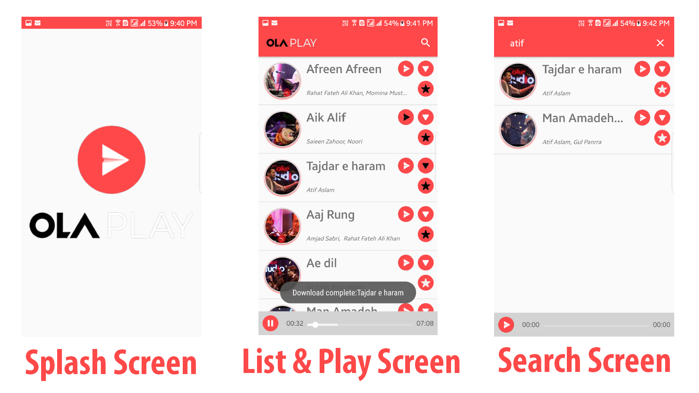

# OlaPlayStudios
Android App for the Ola Android Hiring Challenge on HackerEarth.

Complete features:
-	Use of Web Api to fetch songs details
-	Paging to display result properly via RecyclerView
-	Music Player to stream songs over https via exoplayer
-	Searching songs via Song or artists name via actionbar search
-	Downloading song is implemented to save song in root directory but functionality to access downloaded song from inside app is not implemented due to timelimit

### Libaries Used:
- Glide for image loading
- ExoPlayer as the media player for playing music
- CircularImageView for circular song thumbnail
- Easypermission for implementing permissions

### Screenshots

    

### License

MIT License

Copyright (c) 2019 Sameer Murtaza

Permission is hereby granted, free of charge, to any person obtaining a copy of this software and associated documentation files (the "Software"), to deal in the Software without restriction, including without limitation the rights to use, copy, modify, merge, publish, distribute, sublicense, and/or sell copies of the Software, and to permit persons to whom the Software is furnished to do so, subject to the following conditions:

The above copyright notice and this permission notice shall be included in all copies or substantial portions of the Software.

THE SOFTWARE IS PROVIDED "AS IS", WITHOUT WARRANTY OF ANY KIND, EXPRESS OR IMPLIED, INCLUDING BUT NOT LIMITED TO THE WARRANTIES OF MERCHANTABILITY, FITNESS FOR A PARTICULAR PURPOSE AND NONINFRINGEMENT. IN NO EVENT SHALL THE AUTHORS OR COPYRIGHT HOLDERS BE LIABLE FOR ANY CLAIM, DAMAGES OR OTHER LIABILITY, WHETHER IN AN ACTION OF CONTRACT, TORT OR OTHERWISE, ARISING FROM, OUT OF OR IN CONNECTION WITH THE SOFTWARE OR THE USE OR OTHER DEALINGS IN THE SOFTWARE.